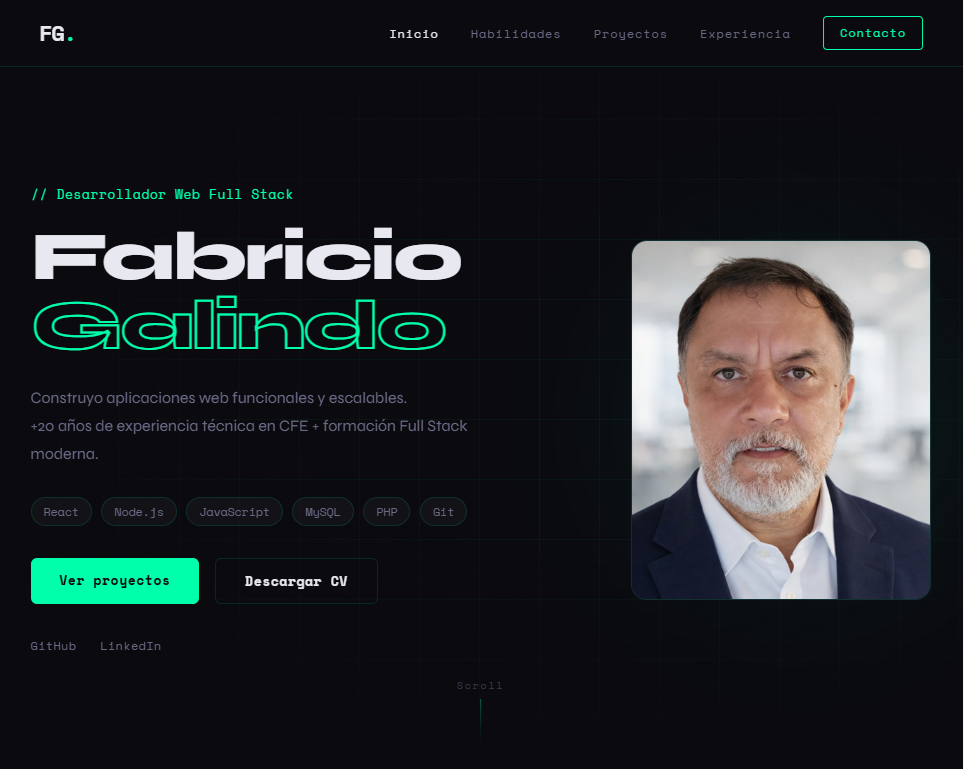
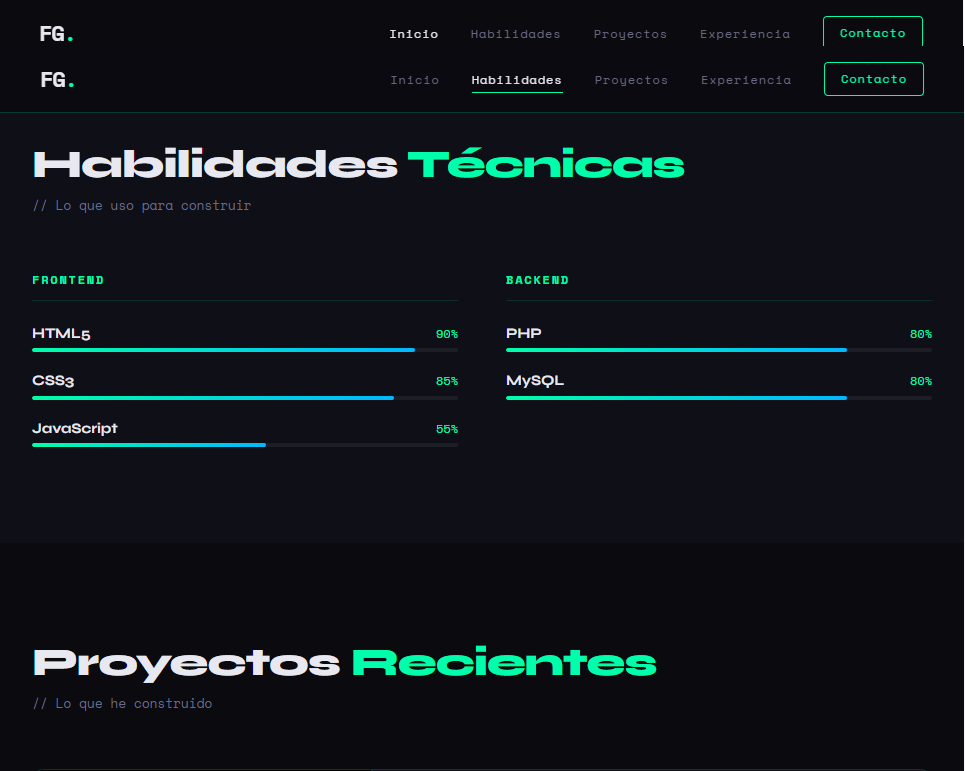

# CV Interactivo — Fabricio Galindo Copado

> Portafolio personal y CV interactivo construido con HTML5, CSS3 y JavaScript vanilla.


---

## 📸 Vista previa




---

## 🔗 Demo en vivo

👉 [Ver portafolio](https://gitalffa.github.io/cv-interactivo/)

---

## 📋 Descripción

Sitio web de una sola página (SPA estática) que funciona como currículum vitae interactivo y portafolio profesional. Presenta experiencia, habilidades técnicas, proyectos destacados y formas de contacto, con animaciones activadas por scroll y un menú responsive para móviles.

---

## 💡 ¿Por qué un CV como página web?

Siendo desarrollador web, me pareció más coherente presentarme
con una página web que con un documento PDF.

Es una forma práctica de mostrar lo que sé hacer mientras
cuento quién soy. Dos objetivos en uno.

---

## 🗂 Estructura del proyecto

```
cv-interactivo/
├── index.html        # Estructura principal (7 módulos BEM)
├── css/
│   └── styles.css    # Estilos con variables CSS y metodología BEM
├── js/
│   └── main.js       # Interactividad: scroll, animaciones, menú hamburguesa
└── img/
    ├── fotoperfil.png
    ├── arround.png
    └── cv-fabricio.pdf
```

---

## ✨ Funcionalidades

- **Navbar fija** con scroll-spy que resalta el link de la sección activa
- **Menú hamburguesa** funcional para pantallas móviles
- **Barras de habilidades animadas** que se activan al hacer scroll (Intersection Observer)
- **Tarjetas de proyectos** con efecto de entrada al aparecer en pantalla
- **Timeline de experiencia** profesional interactivo
- **Sección de contacto** con enlaces directos a email, GitHub y LinkedIn
- **Diseño 100% responsive** — funciona en móvil, tablet y escritorio
- **CV en PDF descargable** directamente desde el botón del hero

---

## 🛠 Tecnologías

| Tecnología        | Uso                                        |
| ----------------- | ------------------------------------------ |
| HTML5 semántico   | Estructura y accesibilidad                 |
| CSS3 + Variables  | Estilos, animaciones, layout responsivo    |
| JavaScript (ES6+) | Interactividad, Intersection Observer, DOM |
| Metodología BEM   | Nomenclatura de clases CSS                 |
| Google Fonts      | Tipografías Syne y Space Mono              |
| GitHub Pages      | Despliegue gratuito                        |

---

## 🚀 Cómo usar localmente

```bash
# Clona el repositorio
git clone https://github.com/gitalffa/cv-interactivo.git

# Entra al directorio
cd cv-interactivo

# Abre index.html en tu navegador
# (o usa Live Server en VS Code)
```

No requiere instalación de dependencias ni servidor backend.

---

## 📁 Secciones del CV

1. **Hero** — Presentación, stack tecnológico y acceso rápido
2. **Habilidades** — Barras de progreso animadas por categoría
3. **Proyectos** — Tarjeta destacada (Around) + grid de proyectos menores
4. **Experiencia** — Timeline: CFE (29 años) → Jubilación → TripleTen Bootcamp
5. **Contacto** — Email, GitHub y LinkedIn

---

## 👤 Autor

**Fabricio Galindo Copado**
Desarrollador Web Full Stack | Ex-técnico CFE (29 años) | Bootcamp TripleTen

- 🌐 [LinkedIn](https://www.linkedin.com/in/fabricio-galindo-copado/)
- 💻 [GitHub](https://github.com/gitalffa)
- ✉️ fabricio.alffa@gmail.com

---

## 📄 Licencia

Este proyecto es de uso personal. Si quieres usar alguna parte como referencia o inspiración, ¡adelante! Da crédito si puedes. 😊
